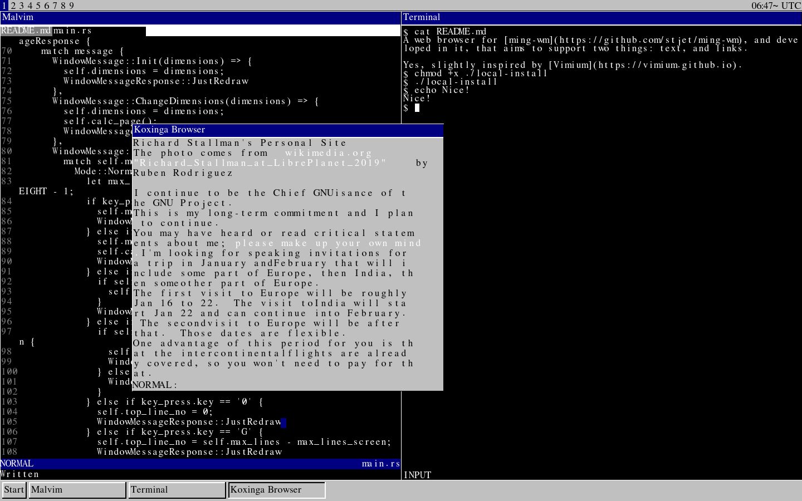
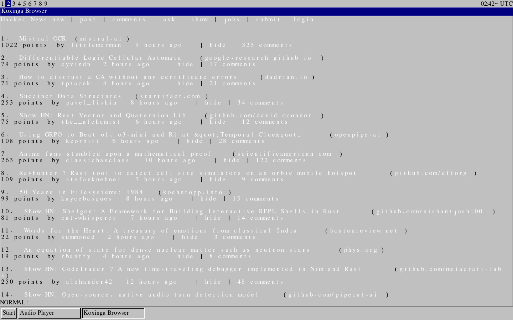
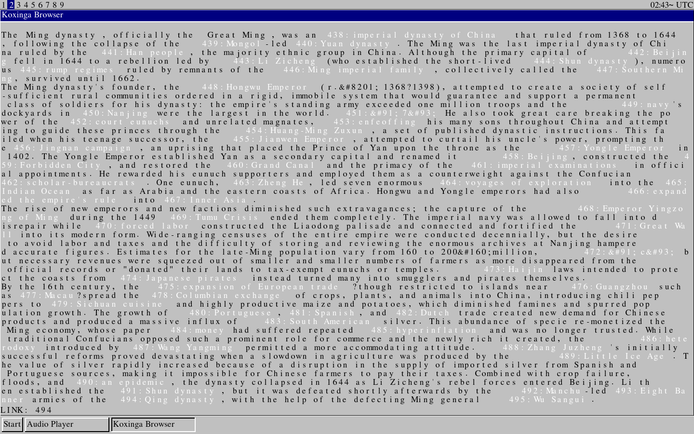

A web browser for [ming-wm](https://github.com/stjet/ming-wm), and developed in it, that aims to support two things: text, and links.

Yes, slightly inspired by [Vimium](https://vimium.github.io).

Hacker News frontpage:

Wikipedia article:

